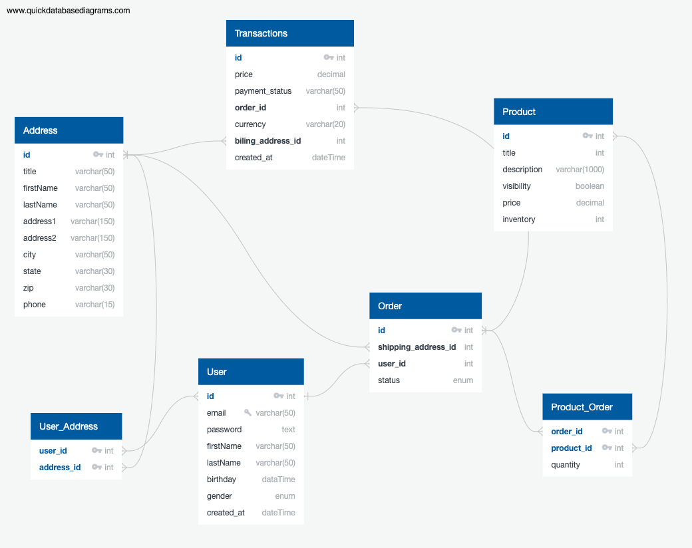

# ECOMMERCE

### Oweview

This is an e-commerce B2C web application. Admin will manage the products and stocks and customers can buy the product using cart. This project is a backend application.

The Backend side will be created on Node.js with express and data will be stored on PostgreSQL database. JWT will be used for authentication/authorization. Payments will be completed using the Strip APIs. AJAX functionality will be done using the Axios library.

### Database Schema

### DEVELOPMENT

To install:

    npm install

Create a database (with a small amount of starter data) and a test database:

    psql < ecommerce.sql

To run this:

    node server.js

To run the tests:

    jest -i
